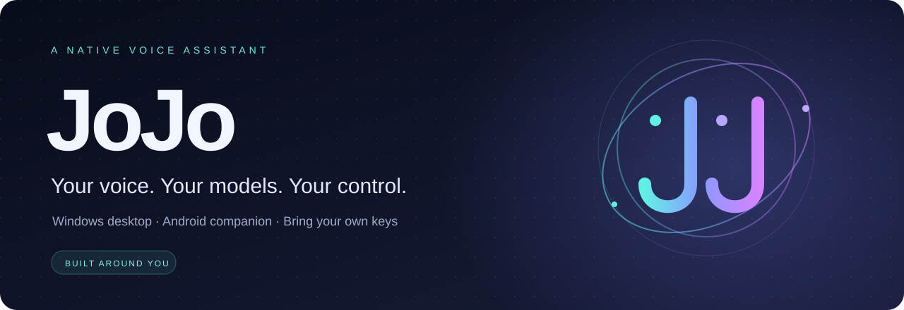

<p align="center"></p>

<p align="center">
  <b>A native voice assistant for your Windows desktop, with an Android companion.</b><br>
  Bring your own model key. Keep your own identity. Choose what JoJo can do.
</p>

<p align="center">
  <a href="#get-started">Get started</a> ·
  <a href="JOJO_PRIVACY.md">Privacy</a> ·
  <a href="JOJO_FEATURE_STATUS.md">Feature status</a> ·
  <a href="JOJO_CONTRIBUTING.md">Contribute</a>
</p>

> **Experimental software.** JoJo is a tool-using assistant, not verified AGI.
> Windows is the supported desktop target. Android currently needs the laptop
> backend and USB connection. No claim of universal app control or perfect security.

## Meet JoJo

Developed by **[Sanskar Gokhroo](https://github.com/sanskargokhroo)**.

- **Native presence.** A desktop dashboard, animated edge glow and voice states:
  listening, thinking, working and speaking. No browser window needed for the desktop UI.
- **Your model account.** Gemini, OpenAI Responses or Anthropic Messages. Enter a
  model ID with the tool/vision capabilities your tasks need. Provider access and
  API charges are yours; a ChatGPT subscription is not an API key.
- **Your voice and memory.** Guided read-aloud enrollment, local speaker embeddings,
  saved context and optional sync to your own Firebase project.
- **Visible controls.** Stop tasks, stop the assistant, review skills, disable
  capabilities or open the explicit uninstall flow.
- **Device awareness.** Desktop and paired Android sessions retain their own identity.
  Payment, banking and wallet interactions have restrictions and manual handoffs.

## Get started

You need Windows 10/11, a microphone, Python with Tkinter and an API key from your
chosen provider. The current development environment uses Python 3.14; dependency
availability on other Python versions has not been fully validated.

Download the [clean source release](https://github.com/sanskargokhroo/JoJo-assistant/releases)
and extract it, or clone the repository:

```powershell
git clone https://github.com/sanskargokhroo/JoJo-assistant.git
cd JoJo-assistant
```

Choose either setup route from the project folder:

```powershell
# Native setup window (or double-click jojo_install.bat)
python jojo_install.py --gui

# Terminal setup; API key entry is hidden
python jojo_install.py --cli
```

Setup creates an isolated `.venv`, installs dependencies and the verified voice
model, and asks for:

1. Your provider, exact model ID and API key.
2. Your optional Firebase **service-account JSON**. Leave blank for local-only memory.
3. Your owner display name and optional profile details.
4. On the dashboard, **Owner setup**: read the displayed numbers and phrase for
   the 9-second enrollment. Wait for a successful result before relying on voice access.

Keys are stored with Windows current-user encryption. New installs keep personal
state in `%LOCALAPPDATA%/JoJo`, outside the source tree. No creator profile is
pre-enrolled. Never share your private data directory.

After setup:

```powershell
.\.venv\Scripts\python.exe jojo_start.py
```

Or double-click `start_jojo.bat`. The launcher enables current-user Windows login
startup. Say **“JoJo”** to begin. Closing the dashboard keeps listening active;
**Stop JoJo** ends the local assistant. [Startup details →](JOJO_STARTUP.md)

## Skills you control

Open **Skills & plugins** in the dashboard to review and toggle desktop control,
Android companion, web/research, file/document tools, memory tools, defensive
checks and Home Assistant. Disabled tools are checked again before execution.
Payment restrictions remain active regardless of switches. Arbitrary code and
generated executable plugins are locked off; there is no unreviewed plugin marketplace.
The memory-tool switch is not a “stop recording all history” switch.

## Your native workspace

Open **Workspace** for editable memory cards, selected-document search with file/page
citations, reviewed routines and schedules, task recovery, conversation handoffs,
temporary capability permissions, encrypted text-file undo and outcome feedback.
Private session suppresses new conversation persistence and saved-context recall.
The executor journals action progress and requires observations after known mutations.
[How to use these features and their limits →](JOJO_WORKSPACE.md)

## Android companion

Native overlays, observed accessibility actions and verified voice sessions are
implemented in `android/`. Pair it with your own laptop backend, grant the required
permissions and connect USB. [Android setup →](android/README.md)

Full paired AI tasks still require the laptop. A separate **Local essentials** mode
supports authenticated app launch, time/battery, timer and lock commands without it.
Optional notification summaries require explicit notification access and an allowlist.
After reboot,
modern Android requires a user tap to resume the microphone. OEM battery rules,
inaccessible controls and app updates can affect behavior. Current source changes
have not all been tested on a physical phone; this repository preparation does not
generate or ship a new APK.

## Know the limits

| Area | Current behavior |
| --- | --- |
| Provider integrations | Gemini existing integration; OpenAI/Anthropic adapters have fixture tests; live provider/model compatibility must be verified with your account |
| Voice ownership | Neural speaker similarity; no proven replay/cloned-voice resistance |
| Speech & reasoning | Uses online services; not an offline assistant |
| Memory | Local journal; optional Firebase sync; semantic embeddings currently Gemini-only |
| Screen control | Accessibility/GUI heuristics; not guaranteed on every app |
| Saved PINs | Optional phone-local vault; compatible screens only; manual fallback |
| Smart home | Configured Home Assistant allowlist, not automatic support for every device |
| Stop | Prevents subsequent actions; actions already performed cannot be undone |

Read [privacy and data flow](JOJO_PRIVACY.md), [PIN and sync behavior](JOJO_PIN_AND_SYNC.md),
[defensive checks](JOJO_SECURITY.md) and [stop/uninstall scope](JOJO_UNINSTALL.md).

## Development

```powershell
python -m unittest discover -s tests
python tests/smoke_local_server.py
python jojo_release.py --check
```

`jojo_release.py --export` creates a clean source-only ZIP from an explicit
allowlist, scans it for credential/personal-data patterns and excludes Git history,
databases, audio, voice profiles, caches, builds and private setup. It does not
sanitize old GitHub history. Never publish a historical checkout containing secrets.

Most first-party modules use the `jojo_` prefix. Required ecosystem filenames
(`README.md`, `requirements.txt`, `__init__.py`, `AndroidManifest.xml`, Gradle files)
retain their standard names. Native Android component identities remain stable.

## Build it with us

Good first contributions: real-device compatibility reports, onboarding polish,
provider fixtures, accessibility fixes and Hindi/Hinglish speech improvements.
Please sanitize logs and screenshots. [Contribution guide →](JOJO_CONTRIBUTING.md)

If JoJo helps you, star the project or share a real workflow. Clear feedback and
reproducible issues help more than inflated claims.

Licensed under [MIT](LICENSE). Third-party code, models and dependencies retain
their own terms; see [third-party provenance](JOJO_THIRD_PARTY_NOTICES.md).
